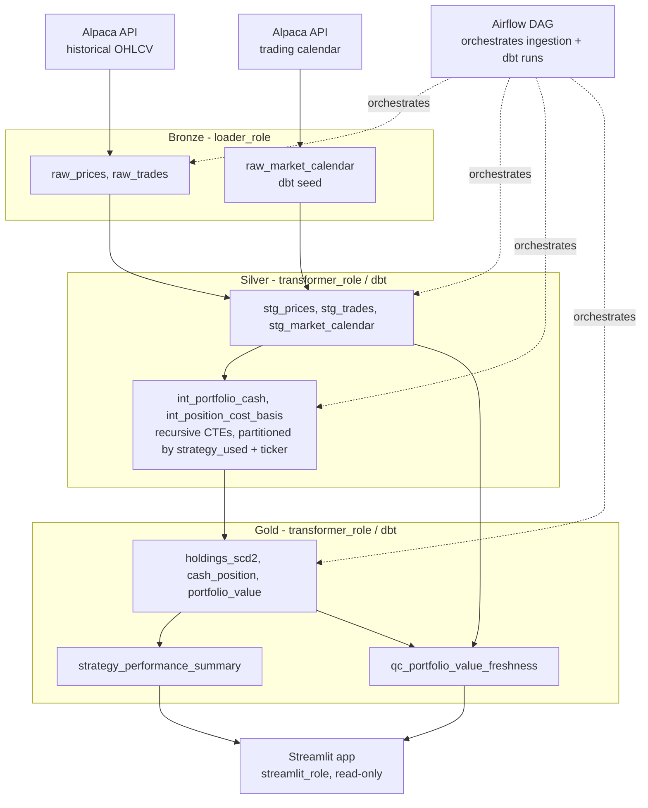

# Trading Strategy Backtest & Execution Platform

A data engineering portfolio project that backtests algorithmic trading
strategies against historical market data, compares their performance
side by side, and is being extended toward live paper execution and an
agent layer for querying results conversationally. Built to demonstrate
incremental loading, SCD Type 2 modeling, role-based access control, and
orchestration patterns relevant to fintech data engineering.

## Architecture



**Role-based access control:**

- `loader_role` — write access to Bronze only. Used by Python ingestion.
- `transformer_role` — read-only on Bronze, read/write Silver + Gold. Used by dbt.
- `streamlit_role` — read-only on Gold only. Used by the Streamlit app
  (`streamlit_svc` service user, own key pair) — narrower than
  `transformer_role` since the dashboard never needs Silver.
- `fivetran_role` — write access to Bronze (`CREATE TABLE`/`STAGE`/
  `FILE FORMAT`, `SELECT`/`INSERT`/`UPDATE`/`DELETE`). Used by the custom
  Fivetran Connector SDK connector for corporate actions — a separate role
  from `loader_role` for the same auditable, independently revocable
  blast-radius reasoning as the rest of the role split.
- `SYSADMIN` — read access across all three schemas, for manual browsing
  without switching roles. `ACCOUNTADMIN` is left untouched, reserved for
  account-level operations.

See [`docs/naming-conventions.md`](docs/naming-conventions.md) for the full
schema/prefix mapping.

## Getting started

### Prerequisites

- Docker + Docker Compose
- Python 3.12
- A Snowflake account
- An Alpaca account (API key/secret — paper trading is sufficient)
- `openssl` (for generating Snowflake key-pair auth credentials)

### 1. Snowflake setup

Generate a key pair per service user that needs one (loader, transformer,
streamlit_svc, fivetran):

```bash
openssl genrsa 2048 | openssl pkcs8 -topk8 -inform PEM -out ~/.snowflake/<service>_key.p8 -nocrypt
openssl rsa -in ~/.snowflake/<service>_key.p8 -pubout -out ~/.snowflake/<service>_key.pub
```

Then, as `ACCOUNTADMIN` (or a role with sufficient privileges), run the
scripts in `sql/` in order (`001` through `006`) — these create the
warehouse, roles (`loader_role`, `transformer_role`, `streamlit_role`,
`fivetran_role`), Bronze tables, stages, streams/tasks, and register each
service user's RSA public key for Fivetran/Streamlit.

### 2. Environment variables

```bash
cp .env.example .env
```

Fill in your Alpaca credentials, Snowflake connection details, and Airflow
metadata DB connection — see the comments in `.env.example` for what each
variable is for.

### 3. Docker network

Airflow's containers expect an externally-created network:

```bash
docker network create trading-net
```

### 4. Run Airflow

```bash
docker compose up --build
```

Airflow's webserver is at `http://localhost:8080`.

### 5. dbt

dbt runs inside the Airflow container in its own venv at
`/opt/airflow/dbt`, or locally against the same Snowflake account:

```bash
dbt deps      # install dbt_utils
dbt seed      # load reference seeds (market calendar)
dbt run
dbt test
dbt docs generate && dbt docs serve --port 8081   # avoids clashing with Airflow's :8080
```

### 6. Fivetran connector (corporate actions)

Create `fivetran/alpaca_corporate_actions/configuration.json` (gitignored,
not committed) with:

```json
{
  "APCA-API-KEY-ID": "...",
  "APCA-API-SECRET-KEY": "...",
  "SYMBOLS": "..."
}
```

Then deploy:

```bash
cd fivetran/alpaca_corporate_actions
fivetran deploy --api-key <api-key> --destination Warehouse --connection alpaca_corporate_actions --configuration configuration.json
```

Lands corporate actions data in `alpaca_corporate_actions.raw_corporate_actions`
(a separate schema — see [`docs/naming-conventions.md`](docs/naming-conventions.md)
for why).

### 7. Streamlit

```bash
cd streamlit
streamlit run streamlit_app.py
```

## Strategies

Strategies are pluggable and config-driven — see `trading-scripts/strategies/`.
Each strategy pairs a signal-generation function with a typed dataclass
config in `strategies/configs.py`'s `STRATEGIES` registry
(`name → (function, config class)`), which gives per-strategy parameter
namespacing and validation without a shared `**kwargs` shape. Two are
implemented today:

- `mean_reversion` — z-score threshold based
- `macd_momentum` — MACD crossover, PPO-style normalized histogram for sizing

To add a new strategy: implement its signal function, define a matching
config dataclass, and register both in `STRATEGIES`.

## Stack

- **Source**: Alpaca API (historical daily OHLCV, US equities + crypto)
- **Warehouse**: Snowflake (Bronze/Silver/Gold, role-based access control)
- **Transformation**: dbt (`dbt-snowflake`)
- **Orchestration**: Airflow (Docker Compose, LocalExecutor)
- **ELT**: Fivetran (custom Connector SDK connector for Alpaca corporate
  actions, deployed and syncing — not yet wired into dbt's `sources.yml`)
- **Client-facing app**: Streamlit — local dev (`streamlit_role`/
  `streamlit_svc`) and Streamlit in Snowflake (Workspaces, app-owner role +
  `GRANT USAGE ON STREAMLIT` RBAC)

See [`docs/build-log.md`](docs/build-log.md) for the detailed build history,
bugs found and fixed, and design-decision rationale behind this stack.

## Roadmap

### Agent layer (MCP tools + tool-calling loop)

A conversational "what and why" layer over the pipeline's data, embedded as
a chat panel in the Streamlit app rather than replacing it.

- [ ] Scope MCP tool contracts: `get_holdings(strategy_used, ticker,
as_of_date)`, `get_trade_history(strategy_used, symbol, start_date,
end_date)`, `get_strategy_signal(strategy_used, symbol, date)`,
      `get_performance_summary(strategy_used, start_date, end_date)`
- [ ] Build MCP server (Python `mcp` SDK, stdio transport)
- [ ] Verify tools work via `claude mcp add` in Claude Desktop
- [ ] Plain tool-calling loop on top of the MCP tools (no LangGraph unless a
      real branching/stateful need shows up)
- [ ] Write 5-10 eval question/expected-answer pairs alongside tool
      development
- [ ] Basic tracing (LangSmith or Langfuse) wired in from the start
- [ ] Embed the agent as a chat panel in the Streamlit app (in-process,
      direct Python import — not another MCP round-trip)

Tools are strategy-agnostic by design — no tool is named after or hardcoded
to a single strategy. No write access via MCP (read-only tools only).

### Layer 2 — Live paper execution

Once a strategy is validated in backtesting, submit its signals as real
orders to Alpaca's paper trading API rather than simulating trades in
Python.

- [ ] Alpaca order-submission client
- [ ] `raw_orders`/`raw_fills`/`raw_positions` Bronze sources, pulled from
      Alpaca's API rather than generated in Python
- [ ] Shared (non-partitioned) cash model — a deliberate divergence from
      backtesting's per-`(strategy, ticker)` partitioning, since Alpaca's
      paper account enforces buying power itself
- [ ] Next-day execution scheduling (signal computed after close, order
      fills at next market open)
- [ ] Wire corporate-actions data (already landing via Fivetran, Phase 8)
      into NAV/cash calculations — not modeled today

Asset scope is constrained by what Alpaca actually offers: US equities and
crypto only.

### Layer 3 — Regime switching / intelligent strategy allocation

A meta-strategy that decides _which_ underlying strategy to run based on
market conditions. Open-ended quant research problem — not yet scoped,
depends on having real comparative performance data from Layers 1 and 2
first.

### Known open items

- Fivetran's managed sync vs. the custom Python ingestion path
  (`gather_historicals.py`) isn't documented yet
- `raw_corporate_actions` isn't yet declared as a dbt `source()` — it lands
  via Fivetran but has no dbt lineage node today
